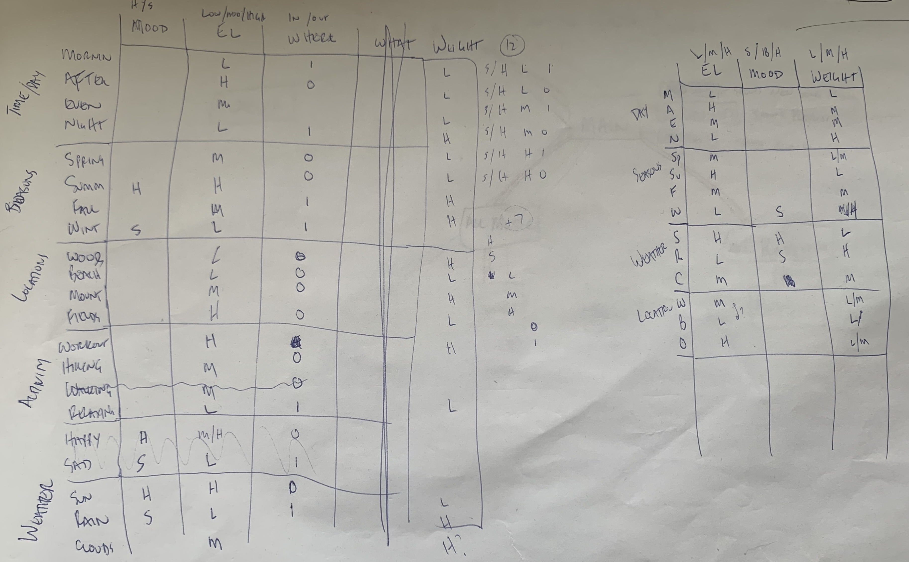
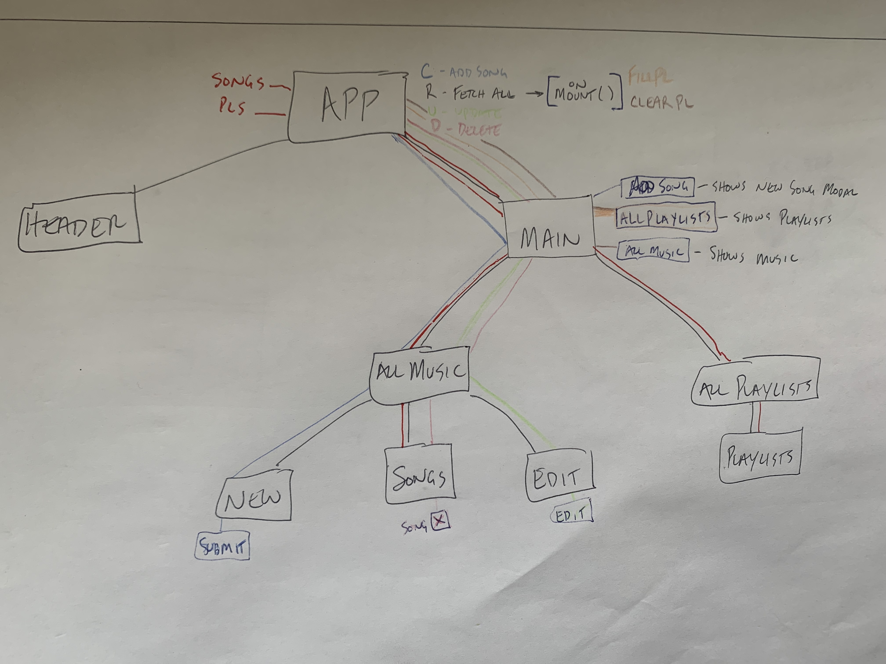
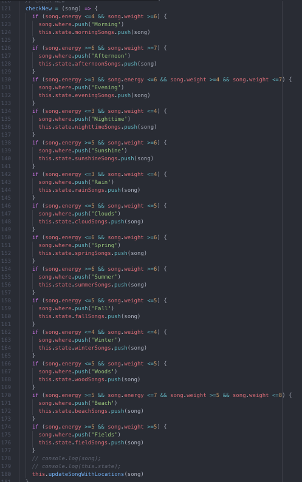
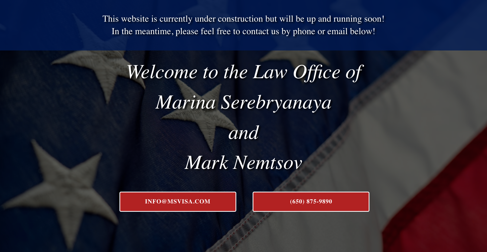
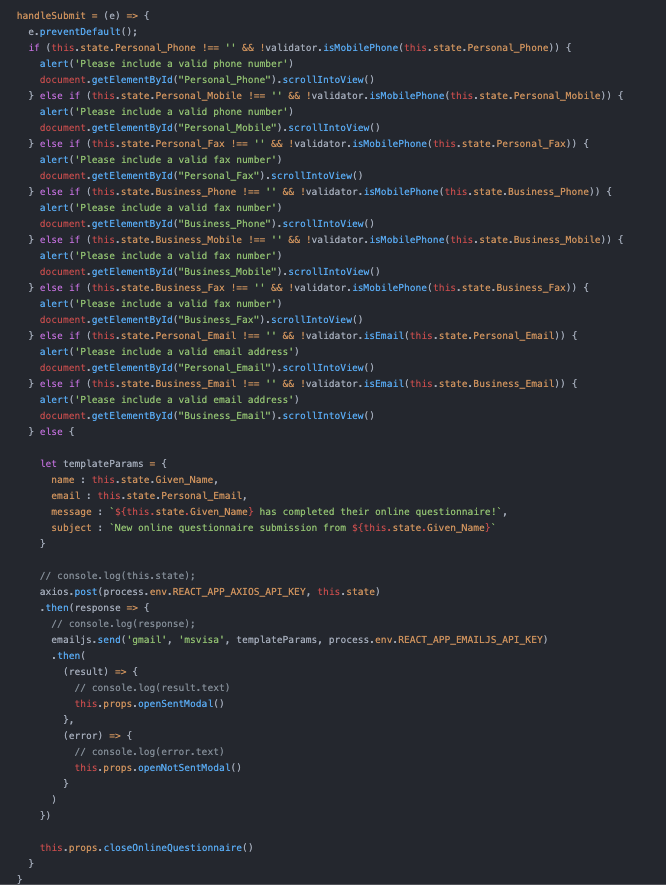

# Vector Interview Resources
- [LinkedIn]((https://www.linkedin.com/in/gianni-nola/))
- [GitHub](https://github.com/Gnola)
- [Portfolio](https://www.gianninola.com/)

---

### [Life's Music](https://mern-music.herokuapp.com/)

#### Slide 8

**Songs Mentioned**
- [Dean Martin - I'm Confessin'](https://www.youtube.com/watch?v=8qLmbLj9yb8)
- [Creedence Clearwater Revival - Green River](https://www.youtube.com/watch?v=cYPK_sl7h44)

#### Slide 9

**Song Rating "Rules"**

**App Layout**

**S11: Code - Adding / Updating Songs**

---

### Msvisa

#### Slide 16

<a href="./_assets/Web_Dev_Questionnaire.pdf" download>Web Dev Questionnaire</a>

#### Slide 17

**Temporary Landing Page**

#### Slide 18

**Questionnaire Code Snippet**

